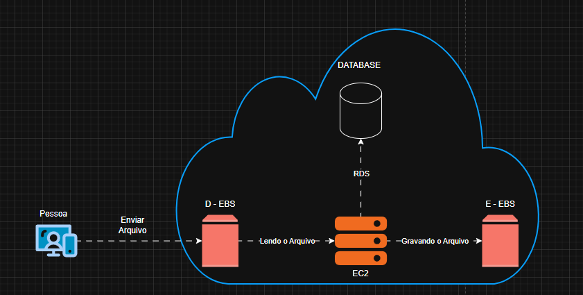

# Documentação-de-Arquitetura-AWS-EC2
Meu nome é Vinícius Henrique Nunes, curso Sistemas de informação no meu terceiro semestre, entusiasta em Cibersegurança e estou me aprofundando em sistemas AWS.

Nesta documentação apresentarei a construção de uma arquitetura básica na AWS utilizando o serviço EC2, com foco na criação e gerenciamento de AMIs e snapshots EBS.

# 📦 AWS EC2 – AMI, Snapshots EBS e Desafio de Instâncias

Documentação prática sobre criação e uso de imagens AMI, snapshots EBS e manipulação de instâncias EC2 na AWS.

---

## 📌 1. Criação e uso de imagens AMI

### 🔹 O que é uma AMI?

Uma **Amazon Machine Image (AMI)** é um template utilizado para criar instâncias EC2. Ela contém:

* Sistema operacional
* Configurações
* Aplicações instaladas
* Snapshots EBS usados para criar os discos da instância.

Em outras palavras: uma AMI é um modelo reutilizável para criar instâncias com a mesma configuração.

---

### 🔹 Componentes de uma AMI

Uma AMI inclui:

* **Snapshots EBS** (armazenamento)
* **Permissões de execução**
* **Mapeamento de dispositivos (volumes)**

---

### 🔹 Criando uma AMI (via EC2)

1. Acesse o console EC2
2. Selecione a instância
3. Clique em:

   * `Actions` → `Image and templates` → `Create Image`
4. Configure:

   * Nome da imagem
   * Descrição
   * Volumes (opcional)
5. Clique em **Create Image**

---

### 🔹 Casos de uso

* Backup completo de servidores
* Criação de ambientes padronizados
* Escalabilidade (clonagem rápida de instâncias)

---

## 📌 2. Snapshots EBS

### 🔹 O que é um Snapshot?

Um **snapshot EBS** é um backup pontual de um volume. Ele salva apenas os blocos alterados (incremental).

Benefícios:

* Redução de custo
* Backup eficiente
* Alta disponibilidade (replicado na região AWS)

---

### 🔹 Como funcionam?

* Primeiro snapshot = completo
* Próximos = incrementais
* Armazenados no Amazon S3 (gerenciado pela AWS)

---

### 🔹 Criando um Snapshot

#### Via Console:

1. Acesse EC2 → Snapshots
2. Clique em **Create Snapshot**
3. Escolha o volume
4. Adicione descrição (opcional)
5. Clique em **Create Snapshot**

---

### 🔹 Boas práticas

* Parar a instância antes do snapshot (para consistência)
* Automatizar backups com:

  * AWS Backup
  * Data Lifecycle Manager 

---

### 🔹 Exclusão de Snapshot

⚠️ Atenção:

* Não é possível deletar snapshot usado por uma AMI
* É necessário remover a AMI antes 

---

### 🔹 Quando usar Snapshot vs AMI?

| Situação                    | Melhor escolha |
| --------------------------- | -------------- |
| Backup de volume específico | Snapshot       |
| Backup completo da máquina  | AMI            |

---

## 🔍 3. Diagrama de um Sistema AWS usando EC2

> 💡 Clique na imagem para abrir o diagrama editável no draw.io

## ❗ Problema

Como garantir backup, replicação e rápida recuperação de uma instância EC2 em caso de falha?

R: Utilizar AMIs para replicação de instâncias e Snapshots EBS para backup de dados persistentes.

## 🔐 Considerações de Segurança

Com meu estudo de cibersegurança, percebi algumas implementações de algumas boas práticas de segurança que possam ser consideradas:

- Uso de pares de chaves para acesso seguro via SSH
- Restrição de acesso através de Security Groups
- Abertura apenas das portas necessárias (ex: 22 para SSH)
- Aplicação do princípio do menor privilégio (IAM)

Essas práticas ajudam a reduzir a superfície de ataque e aumentam a segurança do ambiente.

## 📌 Conclusão

* **AMI** = imagem completa da instância
* **Snapshot** = backup de volume
* Ambos são essenciais para:

  * Backup
  * Escalabilidade
  * Recuperação de desastres

---

## 📚 Referências

* Documentação oficial AWS (EC2 e EBS)
* Materiais do Curso de AWS da DIO.ME

---
